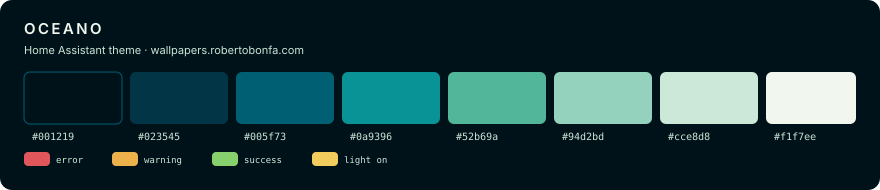

# Oceano — tema per Home Assistant / Home Assistant theme



Tema scuro blu-verde per Home Assistant, derivato dalla palette **Oceano** di
[wallpapers.robertobonfa.com](https://wallpapers.robertobonfa.com).
Otto stop, dall'abisso quasi nero alla schiuma, piu quattro accenti
semantici scelti per restare leggibili sui verdazzurri.

A blue-green dark theme for Home Assistant, derived from the **Oceano**
palette used on [wallpapers.robertobonfa.com](https://wallpapers.robertobonfa.com).
Eight stops from near-black abyss to sea foam, plus four semantic accents
picked to stay legible against the teals.

---

## 🎨 Palette

| Token | Hex | Uso | Use |
|---|---|---|---|
| O0 | `#001219` | sfondo app, header, sidebar | app background, header, sidebar |
| O1 | `#023545` | superficie delle card | card surface |
| O2 | `#005f73` | bordi, divider, disabilitati | borders, dividers, disabled |
| O3 | `#0a9396` | accent, slider, selezioni | accent, sliders, selections |
| O4 | `#52b69a` | colore primario, icone attive | primary colour, active icons |
| O5 | `#94d2bd` | hover, stati attivi | hover, active states |
| O6 | `#cce8d8` | testo secondario | secondary text |
| O7 | `#f1f7ee` | testo primario | primary text |

**Semantici / Semantic** — `#e0565b` errore·error · `#edb14b` avviso·warning ·
`#86d16d` successo·success · `#f2cd5e` luci accese·lights on

---

## 📦 Contenuto della cartella / Folder contents

```
Oceano/
├── oceano.yaml                        # il tema / the theme
├── Instructions.md                    # questo file / this file
├── preview-palette.svg                # anteprima palette / palette preview
├── changelog.md
├── handoff.md
└── backgrounds/
    ├── oceano-bg.svg                  # sorgente vettoriale / vector source
    ├── oceano-bg-2560x1440.png        # desktop e tablet / desktop and tablet
    ├── oceano-bg-1170x2532.png        # smartphone
    └── generate-backgrounds.py        # rigenera i PNG / regenerate the PNGs
```

---

## 🇮🇹 Installazione

### 0. Dove si trova la cartella di configurazione

La documentazione di Home Assistant chiama questa cartella `/config/`, ma il
nome che vedi dipende da come ci accedi. **È sempre la stessa directory**, quella
che contiene `configuration.yaml`:

| Come ci accedi | Cosa vedi |
|---|---|
| Add-on **File editor** | `homeassistant/` — è già la radice all'apertura |
| Add-on **Studio Code Server** | `/config/` |
| Add-on **Advanced SSH & Web Terminal** | `/config/` (o `/homeassistant/` sulle versioni recenti) |
| Add-on **Samba share** (da Finder o Esplora risorse) | condivisione `config` |
| **SFTP** (client tipo Cyberduck, FileZilla, Transmit) | `homeassistant/` su HAOS |
| Installazione **Container / Core** | la cartella che hai montato come config |

Quindi, se usi **HAOS con File editor**, ogni volta che qui leggi `/config/…`
tu vai in `homeassistant/…`. Non devi creare nessuna cartella `config`.

> ⚠️ **Se ti colleghi in SFTP all'add-on SSH, non sei nella cartella giusta.**
> Il client ti fa atterrare in `/root/`, che è la home dell'add-on: un container
> separato, che Home Assistant non legge e che viene azzerato a ogni
> aggiornamento dell'add-on. Le voci `config/`, `homeassistant/`, `addons/`,
> `media/`, `share/`, `ssl/` che vedi lì sono **collegamenti simbolici**
> (riconoscibili dalla freccetta sull'icona) verso le cartelle reali.
>
> Devi quindi **entrare in `homeassistant/`** (o `config/`, è lo stesso posto) e
> lavorare da lì. Se crei `themes` e `www` direttamente in `/root/`, il tema non
> comparirà mai nel selettore e il profilo utente dirà "Nessun tema disponibile".

> ⚠️ **File editor non carica file binari.** Va benissimo per il `.yaml`, ma i
> PNG dello sfondo **non puoi copiarli da lì**. Per quelli usa **Samba share**
> (il modo più comodo: trascini le cartelle dal Finder) oppure **Studio Code
> Server**, che accetta il trascinamento dei file. In alternativa vedi il
> passo 1-bis qui sotto per farne a meno del tutto.

### 1. Copia lo sfondo

Serve la cartella `www` dentro la cartella di configurazione: è quella che Home
Assistant espone pubblicamente sotto l'URL `/local/`. Creala se non c'è, poi
crea dentro la sottocartella `oceano` e copia i due PNG:

```
HAOS  ▸  homeassistant/www/oceano/oceano-bg-2560x1440.png
         homeassistant/www/oceano/oceano-bg-1170x2532.png

altre  ▸  config/www/oceano/oceano-bg-2560x1440.png
          config/www/oceano/oceano-bg-1170x2532.png
```

> La sottocartella `oceano` non è facoltativa: il tema punta a
> `/local/oceano/…`, dove `/local/` è l'alias pubblico di `www/`. Se metti i PNG
> direttamente in `www/` ottieni un 404. In alternativa togli `oceano/` dalla
> riga `lovelace-background` in `oceano.yaml`.

**Con SFTP o Samba share:** apri la condivisione `config` dal Finder, entra in `www`,
trascina dentro l'intera cartella `oceano` di questo pacchetto. Fine.

**Con Studio Code Server:** apri la cartella `www` nell'albero a sinistra,
tasto destro → *New Folder* → `oceano`, poi trascina i PNG dentro.

> **Nota:** se la cartella `www` non esisteva e l'hai appena creata, devi
> riavviare Home Assistant prima che i file vengano serviti. Se `www` c'era già,
> basta un ricaricamento della pagina.

### 1-bis. Se non vuoi (o non puoi) copiare i PNG

Il tema funziona anche senza immagine: apri `oceano.yaml` e sostituisci la riga
`lovelace-background` con questa, che usa solo un gradiente CSS e non richiede
nessun file:

```yaml
      lovelace-background: "linear-gradient(180deg, #001016 0%, #001219 45%, #012a38 100%)"
```

Perdi il crinale e l'alone frost, ma tutto il resto è identico e l'installazione
si riduce al solo file YAML — quindi fattibile interamente da File editor.

### 2. Copia il tema

Serve la cartella `themes` dentro la cartella di configurazione, con dentro
`oceano.yaml`:

```
HAOS   ▸  homeassistant/themes/oceano.yaml
altre  ▸  config/themes/oceano.yaml
```

Via **SFTP o Samba** basta creare la cartella `themes` e trascinarci dentro il
file.

**Con File editor**, che non ha un pulsante per creare cartelle, il trucco è
crearla insieme al file: clicca l'icona della cartella in alto a sinistra per
aprire il browser dei file, poi l'icona del **foglio con il +** (nuovo file), e
come nome scrivi il percorso completo:

```
themes/oceano.yaml
```

File editor crea la cartella `themes` da solo. A quel punto incolla dentro il
contenuto di `oceano.yaml` e salva con l'icona del dischetto.

### 3. Abilita i temi in `configuration.yaml`

Se non l'hai già fatto, aggiungi:

```yaml
frontend:
  themes: !include_dir_merge_named themes
```

Questa riga carica automaticamente ogni file `.yaml` presente nella cartella
`themes`. Se invece usi già `!include themes.yaml`, incolla il contenuto di
`oceano.yaml` dentro quel file rispettando l'indentazione.

> Se `frontend:` è già presente nel tuo `configuration.yaml` ma senza `themes:`,
> aggiungi solo la riga `themes:` sotto, indentata di due spazi. Non duplicare
> la chiave `frontend:`, Home Assistant si rifiuta di avviarsi.

### 4. Riavvia e applica

1. **Strumenti per sviluppatori → YAML → Controlla la configurazione**, per
   sicurezza, poi **Riavvia → Riavvia Home Assistant**.
2. Clicca sul tuo nome in basso a sinistra → **Tema** → seleziona **Oceano**.

> Se **Oceano** non compare nell'elenco — o il profilo utente dice "Nessun tema
> disponibile" e il selettore è grigio — il file non è stato letto. Controlla,
> in quest'ordine:
>
> 1. che `themes/` sia **dentro la cartella di configurazione** e non in
>    `/root/` (vedi l'avviso sull'SFTP al passo 0): è di gran lunga la causa più
>    frequente;
> 2. che il file sia in `themes/oceano.yaml` e non nella radice della config;
> 3. che `configuration.yaml` contenga la riga `themes:` del passo 3.
>
> Dopo aver aggiunto nuovi temi puoi ricaricarli senza riavvio con **Strumenti
> per sviluppatori → YAML → Ricarica temi**.

Per applicarlo a tutti gli utenti come tema predefinito, usa l'azione
`frontend.set_theme`:

```yaml
action: frontend.set_theme
data:
  name: Oceano
  mode: dark
```

### 5. Sfondo su smartphone

Il tema punta al PNG desktop. Se vuoi la versione verticale sul telefono,
modifica la riga `lovelace-background` in `oceano.yaml` sostituendo il nome
del file con `oceano-bg-1170x2532.png`.

### Se lo sfondo non appare

- Verifica che il file risponda aprendo `http://<tuo-ha>:8123/local/oceano/oceano-bg-2560x1440.png` nel browser. Se ottieni 404, il PNG non è dove pensi: ricontrolla che sia in `www/oceano/` dentro la cartella di configurazione.
- Se hai appena creato la cartella `www`, riavvia Home Assistant: i file dentro `www` vengono serviti solo dopo un riavvio.
- Svuota la cache del browser: lo sfondo Lovelace viene memorizzato in modo aggressivo.
- Alcune dashboard con `background:` impostato a livello di vista sovrascrivono il tema: rimuovi quella impostazione.
- Se hai caricato i PNG con File editor, sono corrotti: quell'add-on tratta tutto come testo. Ricaricali via Samba o Studio Code Server.

### Personalizzare

Il file è commentato per blocchi. Se vuoi un accento diverso cambia
`primary-color` e `accent-color`; se preferisci card senza bordo, imposta
`ha-card-border-width: "0px"`. Per rigenerare gli sfondi in altre risoluzioni,
modifica la lista `OUT` in `backgrounds/generate-backgrounds.py` ed esegui:

```bash
pip install pillow numpy
python3 generate-backgrounds.py
```

---

## 🇬🇧 Installation

### 0. Where the configuration folder is

The Home Assistant documentation calls this folder `/config/`, but the name you
see depends on how you reach it. **It is always the same directory** — the one
holding `configuration.yaml`:

| How you access it | What you see |
|---|---|
| **File editor** add-on | `homeassistant/` — it is already the root when you open it |
| **Studio Code Server** add-on | `/config/` |
| **Advanced SSH & Web Terminal** add-on | `/config/` (or `/homeassistant/` on recent versions) |
| **Samba share** add-on (from Finder or File Explorer) | the `config` share |
| **SFTP** (Cyberduck, FileZilla, Transmit, …) | `homeassistant/` on HAOS |
| **Container / Core** install | whatever folder you mounted as config |

So on **HAOS with File editor**, wherever this guide says `/config/…` you go to
`homeassistant/…`. There is no `config` folder to create.

> ⚠️ **If you connect over SFTP to the SSH add-on, you are not in the right
> folder.** Your client drops you in `/root/`, the add-on's home: a separate
> container that Home Assistant never reads and that is wiped on every add-on
> update. The `config/`, `homeassistant/`, `addons/`, `media/`, `share/`, `ssl/`
> entries you see there are **symlinks** (spot the little arrow on the icon) to
> the real folders.
>
> So **go into `homeassistant/`** (or `config/` — same place) and work from
> there. Create `themes` and `www` straight in `/root/` and the theme will never
> show up in the picker, with the profile page reporting "No theme available".

> ⚠️ **File editor cannot handle binary files.** It is fine for the `.yaml`, but
> you **cannot copy the background PNGs with it**. Use **Samba share** instead
> (easiest: drag the folders straight from your file manager) or **Studio Code
> Server**, which accepts drag-and-drop. Or skip the images entirely — see
> step 1-bis below.

### 1. Copy the background

You need a `www` folder inside the configuration folder: that is what Home
Assistant serves publicly under the `/local/` URL. Create it if missing, then
create a `oceano` subfolder inside and copy both PNGs into it:

```
HAOS   ▸  homeassistant/www/oceano/oceano-bg-2560x1440.png
          homeassistant/www/oceano/oceano-bg-1170x2532.png

others ▸  config/www/oceano/oceano-bg-2560x1440.png
          config/www/oceano/oceano-bg-1170x2532.png
```

> The `oceano` subfolder is not optional: the theme points at `/local/oceano/…`,
> where `/local/` is the public alias for `www/`. PNGs dropped straight into
> `www/` give you a 404. Alternatively, drop `oceano/` from the
> `lovelace-background` line in `oceano.yaml`.

**With SFTP or Samba share:** open the `config` share, go into `www`, drag the whole
`oceano` folder from this package into it. Done.

**With Studio Code Server:** open the `www` folder in the sidebar, right-click →
*New Folder* → `oceano`, then drag the PNGs in.

> **Note:** if the `www` folder did not exist and you just created it, restart
> Home Assistant before the files are served. If `www` was already there, a page
> reload is enough.

### 1-bis. If you cannot (or would rather not) copy the PNGs

The theme works without the image. Open `oceano.yaml` and replace the
`lovelace-background` line with this one, which uses a pure CSS gradient and
needs no files at all:

```yaml
      lovelace-background: "linear-gradient(180deg, #001016 0%, #001219 45%, #012a38 100%)"
```

You lose the ridge and the frost glow, but everything else is identical and the
install becomes a single YAML file — so it is doable entirely from File editor.

### 2. Copy the theme

You need a `themes` folder inside the configuration folder, holding
`oceano.yaml`:

```
HAOS   ▸  homeassistant/themes/oceano.yaml
others ▸  config/themes/oceano.yaml
```

Over **SFTP or Samba**, just create the `themes` folder and drop the file in.

**In File editor** there is no button to create a folder, so create it together
with the file: click the folder icon at the top left to open the file browser,
then the **page-with-a-plus** icon (new file), and type the full path as the
name:

```
themes/oceano.yaml
```

File editor creates the `themes` folder for you. Then paste the contents of
`oceano.yaml` in and save with the disk icon.

### 3. Enable themes in `configuration.yaml`

If you have not done so already, add:

```yaml
frontend:
  themes: !include_dir_merge_named themes
```

This line automatically loads every `.yaml` file in the `themes` folder.
If you already use `!include themes.yaml`, paste the contents of `oceano.yaml`
into that file, keeping the indentation intact.

> If `frontend:` is already in your `configuration.yaml` but without `themes:`,
> just add the `themes:` line under it, indented by two spaces. Do not duplicate
> the `frontend:` key — Home Assistant will refuse to start.

### 4. Restart and apply

1. **Developer tools → YAML → Check configuration**, to be safe, then
   **Restart → Restart Home Assistant**.
2. Click your name in the bottom left → **Theme** → pick **Oceano**.

> If **Oceano** is not in the list — or the profile page says "No theme
> available" and the picker is greyed out — the file was not read. Check, in
> this order:
>
> 1. that `themes/` is **inside the configuration folder** and not in `/root/`
>    (see the SFTP warning in step 0): by far the most common cause;
> 2. that the file sits at `themes/oceano.yaml` and not in the config root;
> 3. that `configuration.yaml` has the `themes:` line from step 3.
>
> Once set up, new themes can be picked up without a restart via **Developer
> tools → YAML → Reload themes**.

To make it the default for every user, call the `frontend.set_theme` action:

```yaml
action: frontend.set_theme
data:
  name: Oceano
  mode: dark
```

### 5. Background on phones

The theme points at the desktop PNG. For the portrait version on your phone,
edit the `lovelace-background` line in `oceano.yaml` and swap the filename for
`oceano-bg-1170x2532.png`.

### If the background does not show up

- Check the file is reachable at `http://<your-ha>:8123/local/oceano/oceano-bg-2560x1440.png`. A 404 means the PNG is not where you think — make sure it is in `www/oceano/` inside the configuration folder.
- If you just created the `www` folder, restart Home Assistant: files in `www` are only served after a restart.
- Clear your browser cache: the Lovelace background is cached aggressively.
- Dashboards with a view-level `background:` override the theme — remove that setting.
- If you uploaded the PNGs through File editor they are corrupted: that add-on treats everything as text. Re-upload them via Samba or Studio Code Server.

### Customising

The file is commented block by block. For a different accent, change
`primary-color` and `accent-color`; for borderless cards, set
`ha-card-border-width: "0px"`. To regenerate the backgrounds at other
resolutions, edit the `OUT` list in `backgrounds/generate-backgrounds.py` and run:

```bash
pip install pillow numpy
python3 generate-backgrounds.py
```

---

## ⚙️ Note tecniche / Technical notes

- Il tema è dichiarato interamente sotto `modes: dark:`. Home Assistant applica
  prima la base scura predefinita, poi le variabili del tema: nessuna variante
  chiara, nessun residuo di colori chiari.
  *The theme lives entirely under `modes: dark:`. Home Assistant applies its
  default dark base first, then the theme variables: no light variant, no
  leftover light colours.*
- Sono definiti i colori di stato per tutti i domini supportati
  (`state-{domain}-{state}-color`), inclusi i `device_class` di `binary_sensor`.
  *State colours are defined for every supported domain
  (`state-{domain}-{state}-color`), including `binary_sensor` device classes.*
- I valori esadecimali sono tra virgolette, come richiesto da YAML.
  *Hex values are quoted, as YAML requires.*
- Testato su Home Assistant 2025.x. Alcune variabili non documentate possono
  cambiare comportamento tra una release e l'altra del frontend.
  *Tested on Home Assistant 2025.x. Some undocumented variables may change
  behaviour between frontend releases.*

---

## 📄 Licenza / License

MIT — Roberto Bonfa · [robertobonfa.com](https://robertobonfa.com)
